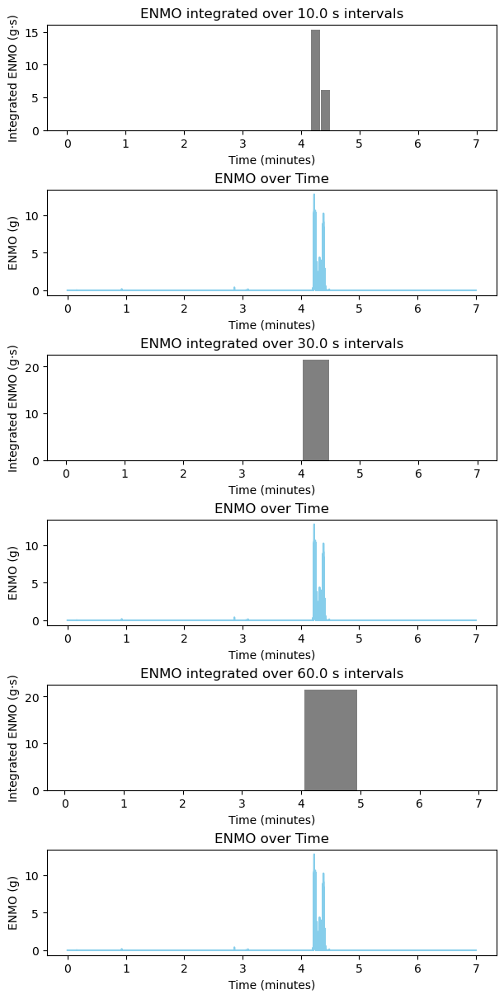

# ENMO Epoch Analysis (Axivity AX3 Data)

**GitHub Repository:** (https://github.com/AchrafNaimy/MAM2ADMM-Series00-Git-AchrafNaimy.git)

**Team Members:**  
- Achraf Naimy  

---
This notebook computes and plots **ENMO (Euclidean Norm Minus One)** integrated over epochs of **10s, 30s, and 60s** using wrist accelerometer data.

## Step 1: Import Libraries
We import `pandas` for data handling, `numpy` for numerical calculations, and `matplotlib` for visualization. 
These are essential for loading accelerometer data, computing ENMO, and plotting results.

## Step 2: Load Data
We read the CSV file containing accelerometer readings (`t`, `x`, `y`, `z`). 
Lines starting with '#' are ignored as comments. 
Only relevant columns are selected for analysis.

## Step 3: Compute ENMO
ENMO (Euclidean Norm Minus One) removes the gravitational component from acceleration.  
We calculate the vector magnitude of acceleration, subtract 1 g, and keep only positive values.  
This gives a measure of physical activity intensity.

## Step 4: Epoch Integration
We divide the data into epochs of 10, 30, and 60 seconds.  
For each epoch, we integrate ENMO values to summarize activity in that time interval.

## Step 5: Visualization
We create 6 vertical plots:
1. Bar plots of integrated ENMO for each epoch length.
2. Line plots of raw ENMO over time.
This allows comparison between raw and summarized activity.

def load_data(filename):
    df = pd.read_csv(filename, comment="#")[["t", "x", "y", "z"]]
    df["t_min"] = df["t"] / 60
    return df

def compute_enmo(df):
    dt = np.median(np.diff(df["t"]))
    acc_norm = np.sqrt(df["x"]**2 + df["y"]**2 + df["z"]**2)
    df["enmo"] = np.maximum(acc_norm - 1.0, 0.0)
    return df, dt

def epoch_integrated_enmo(df, epoch_length, dt):
    idx = np.floor(df["t"] / epoch_length).astype(int)
    results = []
    for e in np.unique(idx):
        mask = idx == e
        integrated = df["enmo"][mask].sum() * dt
        results.append({
            "epoch": e,
            "epoch_center": e * epoch_length + epoch_length / 2,
            "integrated_enmo": integrated
        })
    return pd.DataFrame(results)

def plot_enmo(df, epoch_list, dt):
    import matplotlib.pyplot as plt
    fig, axs = plt.subplots(6, 1, figsize=(6, 12), constrained_layout=True)
    for i, ep in enumerate(epoch_list):
        summary = epoch_integrated_enmo(df, ep, dt)
        summary["epoch_center_min"] = summary["epoch_center"] / 60
        axs[2*i].bar(summary["epoch_center_min"], summary["integrated_enmo"], width=(ep/60)*0.9, color="gray")
        axs[2*i].set_ylabel("Integrated ENMO (g·s)")
        axs[2*i].set_xlabel("Time (minutes)")
        axs[2*i].set_title(f"ENMO integrated over {ep} s intervals")
        axs[2*i+1].plot(df["t_min"], df["enmo"], color="skyblue")
        axs[2*i+1].set_ylabel("ENMO (g)")
        axs[2*i+1].set_xlabel("Time (minutes)")
        axs[2*i+1].set_title("ENMO over Time")
    plt.savefig("enmo_6plots_vertical.png", dpi=150)
    plt.show()

